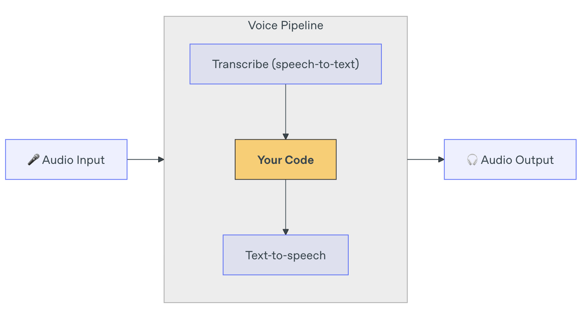

# Following below openai agent SDK

[](https://openai.github.io/openai-agents-python/quickstart/)


⟶ A companion to [OpenAI_S2S]((https://github.com/dudududukim/OpenAI_S2S)), purpose-built to implement a chained architecture.

# Setup

```bash
uv sync
uv run python main.py
```

**PLEASE READ BELOW LINE (main.py 196)**

``` python
# patch_stt_event_handler()         -> un-comment this : if you are using without modifying '.venv/lib/python3.12/site-packages/agents/voice/models/openai_stt.py' _handle_events
```

## Summuries

### 1. Agent definition

Agent = name / instructions / handoff_description

```python
math_tutor_agent = Agent(
    name="Math Tutor",
    handoff_description="Specialist agent for math questions",
    instructions="You provide help with math problems. Explain your reasoning at each step and include examples",
)
```

- Handoff ⊂ Tool
- Tool: function-calling, hosted tools(retrieval/web/computer use), agents-as-tools


### 2. Voice Agent

[](https://openai.github.io/openai-agents-python/voice/quickstart/)



**Voice angent workflow SDK** : [SingleAgentVoiceWorkflow](https://openai.github.io/openai-agents-python/ref/voice/workflow/#agents.voice.workflow.SingleAgentVoiceWorkflow)

**PCM** : Pulse Code Modulation

Results
```bash
14:15:40 [LIFECYCLE] {"event": "turn_started", "type": "voice_stream_event_lifecycle"}
14:15:43 [LIFECYCLE] {"event": "turn_ended", "type": "voice_stream_event_lifecycle"}
14:15:43 [LIFECYCLE] {"event": "session_ended", "type": "voice_stream_event_lifecycle"}
```


# References
- handoff : https://openai.github.io/openai-agents-python/ref/agent/?utm_source=chatgpt.com
- voice agent : https://openai.github.io/openai-agents-python/voice/quickstart/